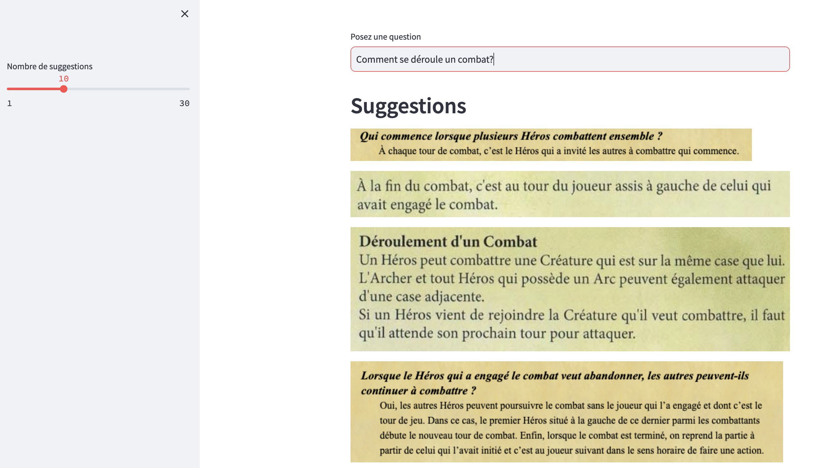
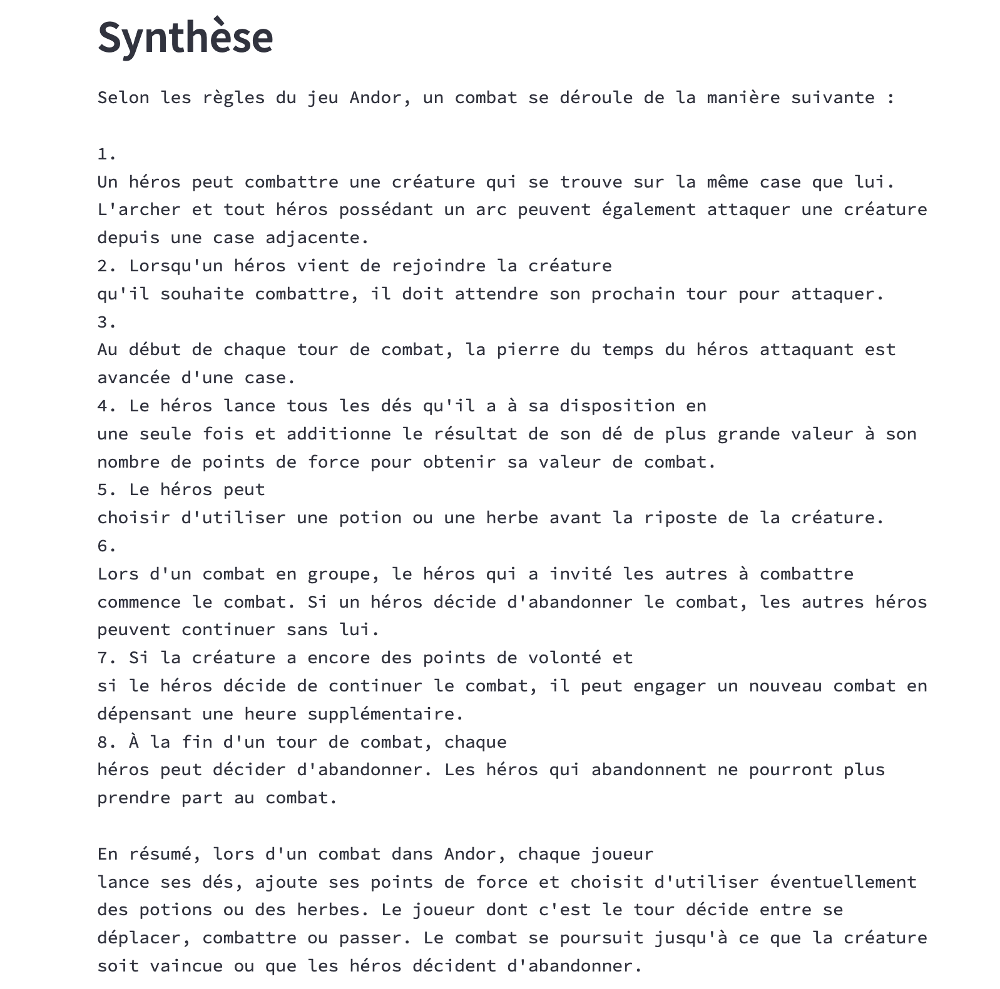

# Andor FAQ LLM

This is a prototype for a search engine for the [Andor](https://andor.iello.fr/) tabletop game. It uses OpenAI to index Andor's rulebook and FAQ. It suggests parts of the rulebook when a question is asked, and will also synthesize an answer. The cool idea is that the user can see the relevant parts of the rulebook, and not just some synthetic answer.

## Demo

https://andor-faq-llm.streamlit.app

## Steps to reproduce

I installed a couple of dependencies on my MacBook Pro.

```sh
brew install tesseract
brew install tesseract-lang
pip install -r requirements.txt
pip install -r requirements.dev.txt
```

I downloaded the PDF of rules from [here](https://www.jeuxavolonte.asso.fr/regles/andor.pdf). This is a scanned PDF, so some OCR is needed to extract the text content.

I split the PDF into images. I used [pdf2image](https://pypi.org/project/pdf2image/) for this.

```py
import pdf2image
import requests

pdf = requests.get('https://www.jeuxavolonte.asso.fr/regles/andor.pdf')
images = pdf2image.convert_from_bytes(pdf.content)

for i, img in enumerate(images[:4], start=1):
    img.save(f'images/rulebook/introduction/page_{i}.png')

for i, img in enumerate(images[4:11], start=1):
    img.save(f'images/rulebook/supplement/page_{i}.png')
```

I also took screenshots of the [FAQ](https://andor.iello.fr/faq/questions-generales/) with Firefox. I stored all the image files into the [`pages`](pages) directory.

I annotated each image with bounding boxes surrounding each text region. It took me ~20 minutes using [VGG Image Annotator](https://www.robots.ox.ac.uk/~vgg/software/via/via_demo.html). I pretty printed the JSON annotations file with [jsonviewer.stack.hu](https://jsonviewer.stack.hu/) and saved it to `annotations.json`.


I then opened each image, cropped each annotated region, and ran OCR on said regions using [pytesseract](https://pypi.org/project/pytesseract/). The following script takes 1 minute to run on my MacBook Pro.

```py
import json
import pathlib
from PIL import Image, ImageDraw
import pytesseract

def crop_rectangle(img, region):
    return img.crop((
        region['shape_attributes']['x'],
        region['shape_attributes']['y'],
        region['shape_attributes']['x'] + region['shape_attributes']['width'],
        region['shape_attributes']['y'] + region['shape_attributes']['height']
    ))

def crop_polygon(img, region):
    mask = Image.new('L', img.size, 0)
    draw = ImageDraw.Draw(mask)
    coords = list(zip(
        region['shape_attributes']['all_points_x'],
        region['shape_attributes']['all_points_y']
    ))
    draw.polygon(coords, fill=255)
    return Image.composite(img, Image.new('RGBA', img.size, (0, 0, 0, 0)), mask)

def crop(img, region):
    if region['shape_attributes']['name'] == 'rect':
        return crop_rectangle(img, region)
    elif region['shape_attributes']['name'] == 'polygon':
        return crop_polygon(img, region)
    else:
        raise ValueError

with open('annotations.json') as f:
    annotations = json.load(f)

for page in annotations['_via_img_metadata'].values():
    filename = page['filename'].split('.')[0]
    img = Image.open(f'pages/{page["filename"]}')
    for i, region in enumerate(page['regions']):
        # Crop
        img_region = crop(img, region)
        # OCR
        text = pytesseract.image_to_string(img_region, lang='fra')
        # Save
        crop_path = pathlib.Path(f'crops/{filename}/{i}')
        crop_path.mkdir(parents=True, exist_ok=True)
        img_region.save(crop_path / 'image.png')
        crop_path.joinpath('text_raw.txt').write_text(text)
```

I saved each cropped region with its associated text content to the [`crops`](crops) directory:

```sh
crops/
├── faq-legende-1
│   ├── 0
│   │   ├── image.png
│   │   └── text_raw.txt
│   ├── 1
│   │   ├── image.png
│   │   └── text_raw.txt
...
```

I then manually formatted each `text_raw.txt` file to remove OCR errors and prettify the formatting. I did some batch cleaning too, such as replacing `’` with `'`. I saved each formatted text to `text_clean.txt`.

Once I had all the text content, I extracted embeddings for each cropped region. I initially some French models from HuggingFace, but the results were abysmal. I ended up using OpenAI. I used the following script to extract embeddings:

```py
import os
import pathlib
import requests
from tqdm import tqdm

api_token = os.environ['OPENAI_API_TOKEN']
api_url = 'https://api.openai.com/v1/embeddings'
headers = {'Authorization': f'Bearer {api_token}'}

embeddings = {}

for crop_path in tqdm(list(pathlib.Path('crops').glob('*/*'))):
    text = crop_path.joinpath('text_clean.txt').read_text()
    response = requests.post(
        api_url,
        headers=headers,
        json={'input': text, 'model': 'text-embedding-ada-002'}
    )
    embedding = response.json()['data'][0]['embedding']
    embeddings[f'{crop_path.parts[1]}/{crop_path.parts[2]}'] = embedding

embeddings_df = pd.DataFrame(embeddings).T
embeddings_df.to_csv('embeddings.csv')
```

Finally, I built a search interface. The steps are as follows:

1. Take as input a query string.
2. Extract embeddings for the query string (using the same OpenAI model).
3. Compute the cosine similarity between the query embedding and all the previously stored embeddings.
4. Display the top `k` cropped regions.
5. In the background, concatenate the text content of the regions and send the questions + regions to the OpenAI model to generate an answer.

This way, the user can see the relevant parts of the documentation nearly instantly, and also get a more detailed answer if needed. Of course, the synthesized answer will never be as good as if the whole rulebook was given as context to the model, but the 4096 character limit of OpenAI's API prevents us from doing so.




